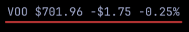
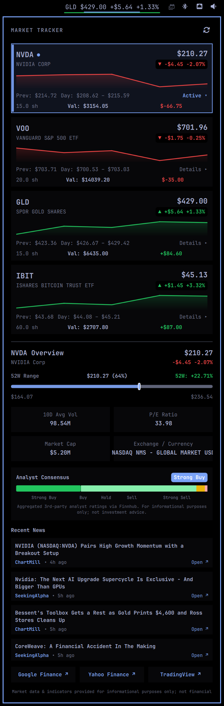
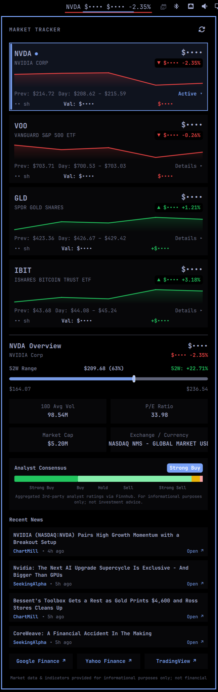

# Market Tracker — Omarchy Plugin

[](https://github.com/tobiasz-p/market-tracker/actions/workflows/ci.yml)


[](https://rubocop.org)

Live ETF & stock price tracker in your Omarchy bar. Displays a real-time rotating ticker with live prices, daily % change, and trend indicators. Click to expand a dashboard featuring watchlist cards with sparklines, 52-week bullet range sliders, analyst consensus breakdowns, portfolio allocation tracking, and recent company news.

---

## Showcase

### 1. Minimal Top Bar Widget
A compact, non-intrusive status bar widget displaying real-time ticker prices, daily percentage deltas, and performance-colored trend underlines.

<p align="center">
  
</p>

### 2. Interactive Analytics Dashboard (Full View)
Clicking the bar widget expands the slide-out financial dashboard:
- **Portfolio Summary & Allocation**: Real-time total portfolio balance, daily P&L, and asset allocation breakdown.
- **Watchlist Cards**: Live sparkline mini-charts, current prices, daily change, and position values.
- **52-Week Performance Slider**: Visual bullet range slider with price pin marker, distance from 52-week high, and 1-year return.
- **Analyst Consensus Distribution**: Wall Street Buy/Hold/Sell rating distribution bar with standardized consensus badge.
- **Financial Metrics**: High-density snapshot of 10-day volume, P/E ratio, Beta, and market capitalization.
- **Live News Feed**: Recent headline feed with relative timestamps and 1-click links to full articles.

<p align="center">
  
</p>

### 3. Privacy-First Stealth Mode
Designed for screen-sharing, video streaming, and open office environments. Masks sensitive dollar totals, portfolio valuations, and share quantities with `••••` while preserving relative percentage market movements.

<p align="center">
  
</p>

---

> [!WARNING]
> ### Disclaimer & Non-Investment Advice
> This plugin and all displayed market data, charts, indicators, and analyst summaries are provided **strictly for informational and educational purposes only**. Nothing contained in this application constitutes investment, financial, legal, or tax advice. No recommendation or endorsement is made regarding the purchase or sale of any security or financial instrument. Always conduct your own independent research and consult a licensed financial advisor before making any investment decisions.

---

## Features

- **Top Bar Widget**: Rotating ticker with live price, % change, and soft colored trend underline indicator.
- **Sparkline Mini-Charts**: Real-time intraday price charts on watchlist cards. On every refresh cycle, the daemon records live trade prices, accumulating up to 60 real-time data points throughout your session without requiring paid historical API subscriptions.
- **52-Week Performance Bullet Slider**: Visual range slider with live price marker pin, distance percentage, and 52W return.
- **Portfolio Tracking**: Configure share counts (`VOO:10,NVDA:25`) to display total portfolio value, daily P&L, and asset allocation breakdown.
- **Analyst Consensus Distribution**: Aggregated Wall Street buy/hold/sell rating distribution bar and overall consensus pill badge.
- **Financial Metrics**: High-density snapshot of 10-day volume, P/E ratio / Beta, market capitalization, and primary exchange.
- **Live News Feed**: Recent headline feed with relative timestamps and 1-click links to full articles.
- **Fast 1-Click Quick Links**: Instant navigation to Google Finance, Yahoo Finance, and TradingView for active tickers.

---

## Requirements

- **Ruby** (standard on Arch/Omarchy; verify with `ruby --version`)
- A free [Finnhub](https://finnhub.io) API key (no credit card required) — [register here](https://finnhub.io/register)
- Internet access

---

## Installation

```bash
# Clone or copy this folder to your plugins directory, then enable:
omarchy plugin enable tobiasz-p.market-tracker
```

Or, if installing via the marketplace:
```bash
omarchy plugin install tobiasz-p.market-tracker
```

---

## Configuration

All settings use `omarchy bar set`:

| Setting | Default | Description |
|---|---|---|
| `symbols` | *(required)* | Comma-separated ticker symbols (e.g. `NVDA,GLD,IBIT` or `NVDA:10,GLD:5` for shares) |
| `refreshSeconds` | `60` | How often to fetch new data (minimum: `15`, maximum: `300`) |
| `rotateSeconds` | `5` | How often the top bar cycles to the next ticker (`0` = pin first) |
| `showPrice` | `true` | Show price in top bar (`"NVDA $214.72 -0.98%"` vs `"NVDA -0.98%"`) |
| `deltaFormat` | `"percent"` | Bar delta display: `"percent"` (`+1.5%`), `"amount"` (`+$3.20`), or `"both"` |
| `showCompanyProfile` | `true` | Fetch 52W range and 2x2 financial metrics grid |
| `showRecommendations` | `true` | Fetch aggregated analyst consensus ratings |
| `showNews` | `true` | Fetch recent company headlines |
| `stealthMode` | `false` | Mask monetary balances and prices with `••••` |

### Quick Start

1. Grab a free key at [finnhub.io/register](https://finnhub.io/register) — shown on your dashboard right after signup.
2. Put it in a `.env` file next to the plugin so it never touches any shared configuration:

```bash
cd ~/.config/omarchy/plugins/tobiasz-p.market-tracker
cp .env.example .env   # add your key after FINNHUB_API_KEY=
omarchy restart shell
```

3. Set your watchlist symbols (and optional portfolio share counts):

```bash
omarchy bar set tobiasz-p.market-tracker symbols NVDA:10,GLD:5,IBIT:20
```

> **Note on Free Tier Usage**: The Finnhub free tier allows 60 API calls/minute. The daemon uses non-blocking TTL caching, sequential request pacing, and rolling price buffers to keep usage well below rate limits.

---

## Gestures & Controls

| Gesture | Action |
|---|---|
| **Left click (Bar)** | Toggle market details panel |
| **Right click (Bar)** | Force immediate quote refresh |
| **Middle click (Bar)** | Cycle to next ticker in watchlist |
| **Watchlist Card Click** | Select ticker and inspect detailed financials/news |

---

## Real-Time Sparklines & Charting

- On every refresh cycle (default: `60s`), the background daemon records the live trade price into a per-ticker in-memory ring buffer.
- As the daemon runs throughout your session, it accumulates up to 60 real-time price points representing intraday movement without requiring paid historical API subscriptions.

---

## Analyst Consensus Methodology

The plugin retrieves third-party Wall Street analyst recommendation trends directly from Finnhub's `/stock/recommendation` endpoint (counts for **Strong Buy**, **Buy**, **Hold**, **Sell**, and **Strong Sell**).

To summarize these diverse analyst opinions into a standardized consensus label, the daemon computes a **weighted arithmetic mean score**:

$$\text{Score} = \frac{(2 \times \text{Strong Buy}) + (1 \times \text{Buy}) + (0 \times \text{Hold}) + (-1 \times \text{Sell}) + (-2 \times \text{Strong Sell})}{\text{Total Analysts}}$$

| Score Range | Consensus Label |
|---|---|
| $\text{Score} > +0.50$ | **Strong Buy** |
| $+0.10 < \text{Score} \le +0.50$ | **Buy** |
| $-0.10 \le \text{Score} \le +0.10$ | **Hold** |
| $-0.50 \le \text{Score} < -0.10$ | **Sell** |
| $\text{Score} < -0.50$ | **Strong Sell** |

> [!NOTE]
> This consensus score is strictly a mathematical aggregation of publicly published third-party analyst ratings provided by Finnhub. It is not an algorithmic trading signal or financial advice.

---

## License

MIT License. Copyright (c) 2026.
